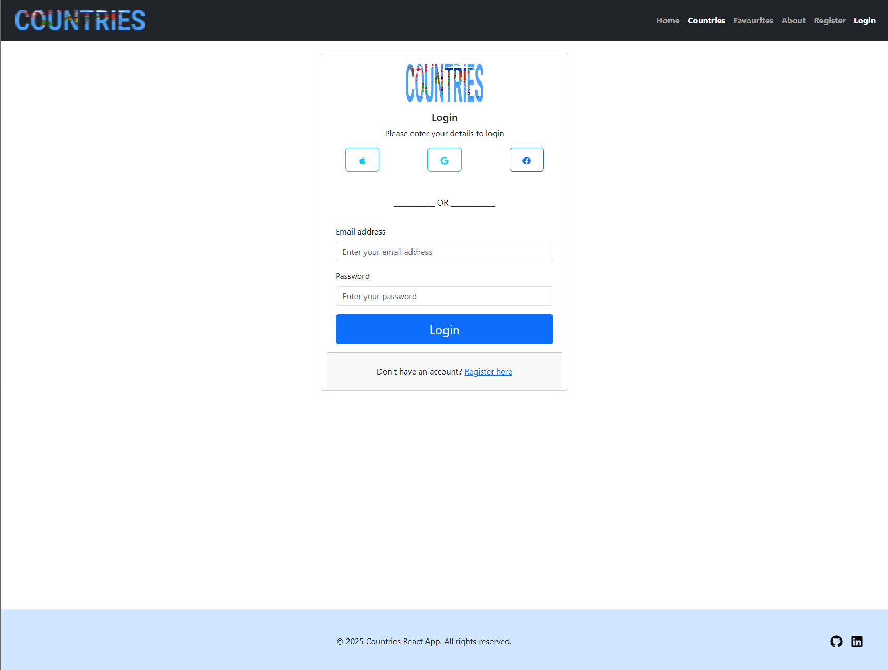
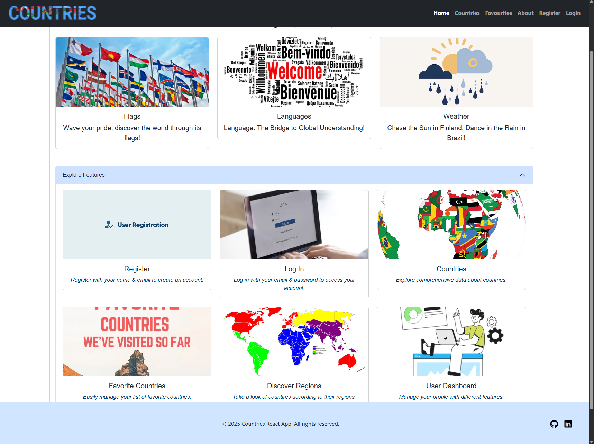
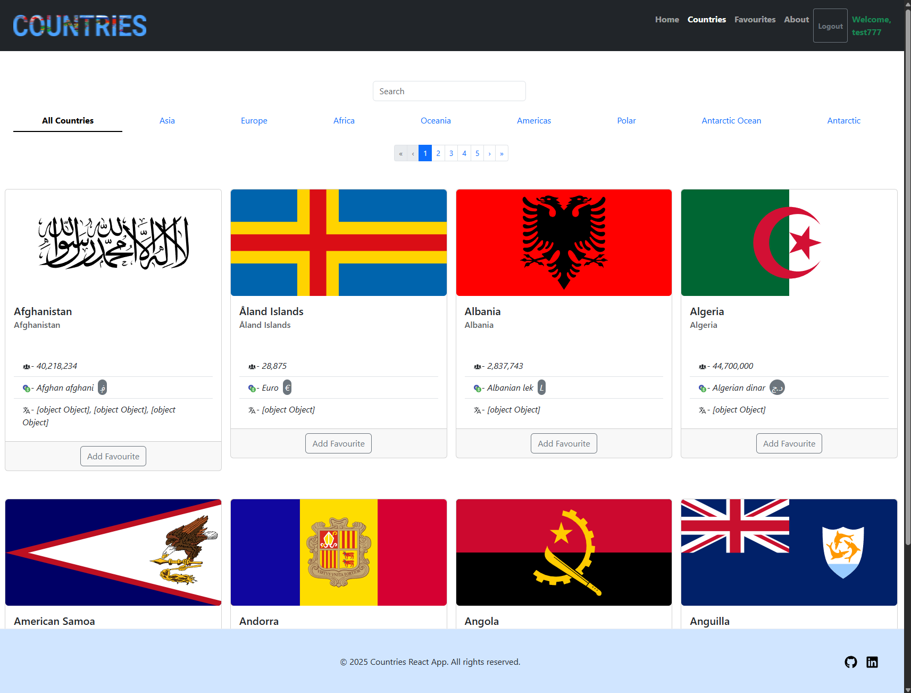
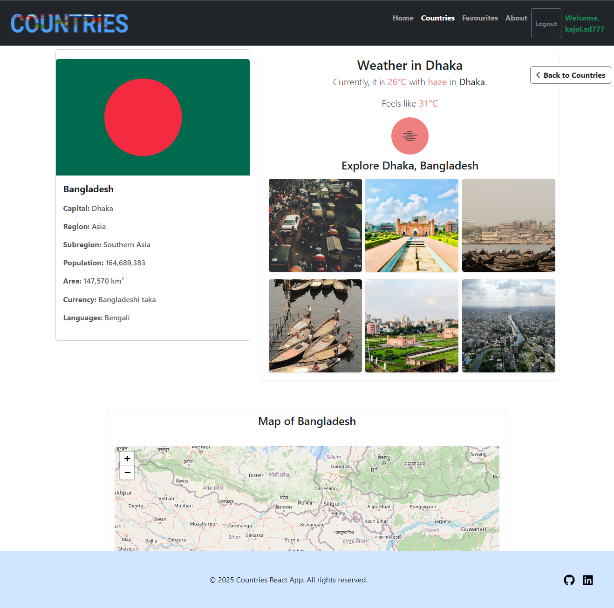

# React Redux Countries App

## Overview

This project is a React application that allows users to view country information and weather data. It utilizes the REST Countries API to fetch country details, an Open Weather Map API to display current weather conditions and unsplash API to get country capital images. Firebase is used for user authentication and data storage, enabling users to create accounts, log in, and store their preferences, including favorite countries.

## Features

- **User Authentication**: Sign up and log in using Firebase Authentication.
- **Country Information**: View details about countries using the REST Countries API.
- **Weather Data**: Access current weather conditions based on selected countries using an Open Weather Map API.
- **Country Capital Images**: Get country capital images using unsplash API.
- **Favorites Management**: Users can add countries to their favorites and can remove them as well.
- **Redux for State Management**: Manages application state seamlessly across components.
- **Firebase for Data Storage**: Stores user data and preferences in Firebase Firestore.

## Technologies Used

- React
- Redux
- REST Countries API
- OpenWeatherMap API
- Unsplash API
- Firebase (Authentication and Firestore)
- Axios for API calls

## Getting Started

### Prerequisites

- Node.js
- npm

## Installation

1. Clone the repository:

   ```bash
   git clone git@github.com:the-sankari/countries-bootstrap-react24k-lessons.git
   ```

2. Navigate to the project directory:

   ```bash
   cd Countries_API
   ```

3. Install dependencies:

   ```bash
   npm install
   ```

4. To start development server:

   ```bash
   npm run dev
   ```

## Configuration

### Set up Firebase:

- Create a new Firebase project at Firebase Console.
- Enable Email/Password authentication in the Authentication section.
- Create a Firestore database and set up rules for read/write access.
- Configure Firebase in your project.

## Live Page

Live page can be access here: Will be deployed soon

## Screenshot

Here are some screenshots of the application:

| Register Page                                                   | Home Page                                                   |
| --------------------------------------------------------------- | ----------------------------------------------------------- |
|  |  |

| Countries Page                                                    | Single Country Page                                                           |
| ----------------------------------------------------------------- | ----------------------------------------------------------------------------- |
|  |  |

## Sources

- [React Documentation: Learn more about React](https://react.dev/learn)
- [Redux Documentation: Understand Redux](https://redux.js.org/introduction/getting-started)
- [Firebase Documentation: Set up Firebase here](https://firebase.google.com/docs/)
- [REST Countries API: Display country details](https://restcountries.com/)
- [OpenWeatherMap API: Explore the weather API here](https://openweathermap.org/guide)
- [Unsplash API: Get images ](https://unsplash.com/documentation)

## Authors and Acknowledgment

- [GitHub @martin-holland](https://github.com/martin-holland)
- [GitHub @kajol](https://github.com/the-sankari)
